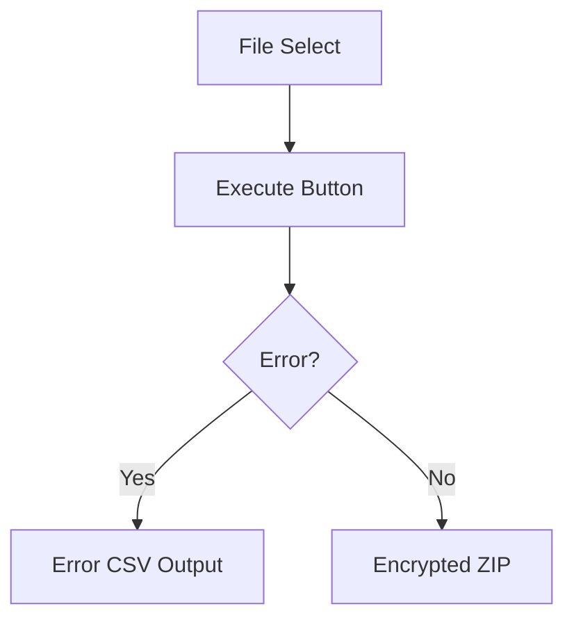

# DocIngest

Universal document preprocessing engine for RAG and Agentic Search.

## What it does

Accepts any document (PDF, PPT, Excel, HTML, images, etc.), automatically parses with AI-assisted extraction, and outputs:

- **`sources/*.md`** — Clean Markdown files with frontmatter (for Agentic Search: grep/glob)
- **`readable/*.md`** — Human-readable refined Markdown (optional, AI-powered cleanup)
- **`chunks.jsonl`** — Chunked text with metadata (for RAG: vector search)
- **`index.json`** — File directory index (for Agent file discovery)
- **`knowledge_map.yaml`** — Structured search guide with keywords and file mapping
- **`knowledge_search.SKILL.md`** — Agent-readable search instructions

Same Markdown serves both RAG and Agentic Search. One source, two consumers.
Optionally, `docingest refine` produces human-friendly versions with Mermaid diagrams, clean tables, and zero noise.

## Architecture

```
Input: any document (PDF/PPT/Excel/HTML/images/text...)
  |
  v
Phase 1: Parse
  Docling (AI layout analysis + TableFormer + OCR)
    -> fallback: TextParser (multi-encoding)
  -> Output: Markdown + per-page data (text + page images)
  |
  v
Phase 1.1: Garbled Text Detection (automatic)
  Detect broken CID-to-Unicode mapping (e.g. embedded JP fonts)
  If garbled -> pymupdf (fitz) re-extracts clean text
  Transparent: normal PDFs unaffected, no config needed
  |
  v
Phase 1.2: Excel Denoising (automatic, all xlsx/xls/csv)
  Unified path -- data-heavy Excel passes through with minimal change,
  layout-heavy Excel gets significant noise removed:
  +-- Row-level dedup  (merged cell -> N identical cells -> collapse to 1)
  +-- Inter-row dedup  (merged rowspan -> N identical rows -> collapse)
  +-- Sparse cell strip (>50% empty cells in a row -> remove empties)
  +-- Embedded image extraction (xlsx zip -> xl/media/ images)
  Zero AI cost. Config-driven, every step independently toggleable.
  |
  v
Phase 1.3: Excel Page Image Generation (optional, requires LibreOffice)
  Excel has no "page" concept -> LibreOffice headless renders to PDF -> screenshots
  +-- max_page_images cap (default 10, excess pages -> text-only + warning)
  +-- max_image_pixels cap (default 4MP, oversized -> downscaled)
  +-- Graceful: no LibreOffice -> silent skip, text-only mode
  |
  v
Phase 1.5: Vision Enrichment (per-page, parallel)
  Every page image + Docling text -> Vision AI
  AI decides: text complete? -> clean up. Has charts? -> describe. Scanned? -> OCR.
  Fallback: Vision fails -> keep Docling text as-is
  -> Output: Enriched Markdown (in memory)
  |
  v
Phase 2: Output
  knowledge/
  +-- sources/*.md       <- Agentic Search (grep/glob)
  +-- assets/            <- Page images + embedded Excel images
  +-- index.json         <- File directory for Agents
  |
  v
Phase 3: Smart Chunking
  auto strategy: format detection -> structure scoring -> best chunker
  +-- heading   (structured docs: split by ## then recursive)
  +-- recursive (unstructured: paragraph -> sentence boundaries)
  +-- slide     (PPTX/PDF slides: pagebreak -> 1 page = 1 chunk)
  +-- sheet     (Excel: pagebreak -> sheet split -> row groups + header repeat)
  +-- whole     (images: 1 file = 1 chunk)
  + Protection rules (tables, code blocks, lists, quotes)
  + Fragment merging (section-boundary aware)
  + Path injection enrichment
  + Metadata: language, last_modified, has_table, has_image_ref
  -> Output: chunks.jsonl
  |
  v
Phase 4: Knowledge Map
  Stage 1 (automatic, zero cost): file index + keyword extraction + reverse index
  Stage 2 (AI, one API call): summary + search strategy guide
  -> Output: knowledge_map.yaml + knowledge_search.SKILL.md

(Optional) Refine -- separate command: `docingest refine`
  sources/*.md -> LLM cleanup -> readable/*.md
  +-- Merge duplicate content (Docling + Vision overlap)
  +-- Remove noise (formulas, HTML comments, openpyxl artifacts)
  +-- Flowcharts -> Mermaid diagrams (when flow is described in text)
  +-- Clean table formatting + metadata header extraction
  +-- Customizable via SKILL files (skills/*.SKILL.md)
  Zero information loss -- only formatting and noise removal.
  Config-driven: refine.default_skill, refine.max_input_tokens
```

## Quick Start

```bash
# Install (editable mode, recommended for development)
pip install -e .

# Or install from requirements.txt
pip install -r requirements.txt

# (Optional) Install LibreOffice for Excel Vision enrichment
# Without it, Excel files use text-only extraction (still works, just no Vision)
winget install TheDocumentFoundation.LibreOffice   # Windows
# brew install --cask libreoffice                  # macOS
# sudo apt install libreoffice                     # Linux

# Process documents
docingest run ./docs/ -o ./knowledge/

# Or with module invocation
python -m docingest.cli run ./docs/ -o ./knowledge/

# With options
docingest run ./docs/ --strategy heading --no-chunks
docingest run ./docs/ -c ./my-config.yaml

# (Optional) Refine for human readability
docingest refine ./knowledge/sources/report.md
docingest refine ./knowledge/sources/*.md --skill refine_flowchart
```

## Python API

```python
from pathlib import Path
from docingest.config import load_config
from docingest.parsers import create_parser
from docingest.chunkers import create_chunker
from docingest.pipeline import run_pipeline

# Load config (auto-merges default.yaml + project docingest.yaml + overrides)
config = load_config(cli_overrides={
    "output": {"dir": "./knowledge"},
    "parsing": {"vision": {"enabled": True}},
})

# Create parser and chunker
parser = create_parser(config)
chunker = create_chunker(config)

# Run pipeline
result = run_pipeline(
    input_paths=[Path("./docs")],
    config=config,
    parser=parser,
    chunker=chunker,
)

# Result
print(f"Processed: {result.successful}/{result.total_files}")
print(f"Chunks: {result.total_chunks}, Tokens: {result.total_tokens}")

# Output files ready at:
#   knowledge/sources/*.md          -> grep/glob
#   knowledge/chunks.jsonl          -> vector embedding
#   knowledge/index.json            -> file directory
#   knowledge/knowledge_map.yaml    -> structured search guide
#   knowledge/knowledge_search.SKILL.md -> agent instructions
```

## CLI Options

```
docingest run [OPTIONS] INPUTS...

Arguments:
  INPUTS    Files or directories to process

Options:
  -o, --output PATH       Output directory (default: ./knowledge)
  -c, --config PATH       Project config YAML (overrides defaults)
  --no-chunks             Disable chunking (Markdown output only)
  --strategy TEXT         Force: auto, heading, recursive, slide, sheet, whole
  --parallel INTEGER      Parallel file processing count
  --help                  Show help
```

```
docingest refine [OPTIONS] FILES...

Arguments:
  FILES     Markdown files to refine (e.g. knowledge/sources/*.md)

Options:
  -o, --output PATH       Base output directory (default: auto-detect from file path)
  -c, --config PATH       Project config YAML
  --skill TEXT            SKILL name (default: refine_default). Custom SKILLs in skills/
  --help                  Show help
```

## Output Format

**sources/*.md** (with YAML frontmatter):
```markdown
---
source: report.pdf
format: pdf
title: Annual Report 2025
language: ja
pages: 120
processed_at: 2026-04-02T10:30:00
---

## Financial Data

Content here...
```

**chunks.jsonl** (one JSON per line):
```json
{
  "id": "report_chunk_003",
  "text": "[来源: sources/report.md > Financial Data > Revenue]\nRevenue grew 15%...",
  "metadata": {
    "source": "sources/report.md",
    "original_file": "report.pdf",
    "format": "pdf",
    "title_path": "Financial Data > Revenue",
    "language": "ja",
    "chunk_index": 3,
    "tokens": 487,
    "has_table": false,
    "has_image_ref": false,
    "last_modified": "2026-04-02T10:00:00"
  }
}
```

**readable/*.md** (human-readable, via `docingest refine`):
```markdown
# Screen Layout Definition

| Item | Content |
| :--- | :--- |
| **Screen ID** | A15S010 |
| **Screen Name** | Batch Check Screen |

## 1. Screen Layout
The screen has three main areas:
- **Button Area**: Execute button display.
- **Message Area**: Message display region.
- **Content Area**: Input items and check results.

### Processing Flow

```

**knowledge_search.SKILL.md** (Agent instructions):
```markdown
# Knowledge Base Search

## Overview
Technical documents on AI Agent tool design and implementation...

## Search Guide
### Technical Concepts
- **Strategy**: RAG hybrid search -> chunks.jsonl
- **Example**: What is an Agent, How MCP works

### Specific Data
- **Strategy**: Agentic Search -> grep sources/
- **Example**: Product master price, Day 6 tasks
```

## Key Features

| Feature | Detail |
|---------|--------|
| **15+ formats** | PDF, PPTX, XLSX, CSV, HTML, DOCX, images, Markdown, TXT... (via Docling) |
| **Per-page Vision AI** | Every page -> AI decides: clean up text / describe charts / OCR scan. Parallel execution |
| **Smart chunking** | Auto strategy selection by format + structure scoring. CJK-aware token estimation |
| **Sheet-aware Excel** | Real sheet names, pagebreak splitting, multi-table detection, header repetition |
| **Excel denoising** | Merged-cell dedup, inter-row dedup, sparse row cleanup, embedded image extraction. Layout-heavy Excel -> 97% noise reduction. Data Excel unaffected |
| **Excel Vision fallback** | LibreOffice -> PDF -> page screenshots -> Vision AI. Recovers content Docling can't extract (diagrams, margin notes). Optional, graceful degradation |
| **Slide-aware PPT/PDF** | Pagebreak detection, slide title extraction, per-slide chunking |
| **Section name injection** | Docling group names (sheet/slide/chapter) injected as Markdown headings |
| **Protection rules** | Tables, code blocks, lists, quotes kept intact. Section-boundary-aware merging |
| **Path injection** | Every chunk: `[来源: file > section > subsection]` |
| **Rich metadata** | language, last_modified, has_table, has_image_ref, sheet_name, slide_index |
| **Knowledge Map** | Auto-generated search guide + AI summary + keyword reverse index |
| **Multi-provider** | Gemini / OpenAI with automatic fallback (via litellm) |
| **Caching** | AI call results cached by content hash (no duplicate API costs) |
| **Config-driven** | All thresholds, strategies, models configurable via YAML |
| **Garbled text recovery** | Auto-detects broken font encoding (CID-to-Unicode) -> pymupdf fallback. Zero config, transparent |
| **AI Refine** | Standalone `docingest refine` command -> human-readable MD with Mermaid flowcharts, clean tables, zero noise. Customizable via SKILL files |
| **Error resilient** | One file fails -> skip + log, others continue. Vision fails -> Docling text fallback |

## Configuration

All settings in `config/default.yaml`. Override per-project with `docingest.yaml`:

```yaml
# Override just what you need
chunking:
  strategy: "heading"
  max_tokens: 1024

models:
  vision:
    primary:
      provider: "google"
      model: "gemini-3-flash-preview"

knowledge_map:
  enabled: true
  ai_summary: true    # false -> Stage 1 only (zero cost)

# Excel denoising (all toggleable)
parsing:
  xlsx:
    denoising:
      enabled: true
      dedup_cells: true           # merged-cell row dedup
      strip_empty_cells: true     # remove sparse empty cells
      extract_images: true        # pull images from xlsx zip
      ensure_page_images: true    # LibreOffice -> PDF -> screenshots
      max_page_images: 10         # Vision page cap (excess -> text-only + warning)
      max_image_pixels: 4000000   # auto-downscale oversized images

# Refine (optional, standalone command)
refine:
  output_dir: "readable"          # output inside knowledge/
  model: "chunking_assist"        # reuses existing model config
  max_input_tokens: 8000          # skip large files with warning
  default_skill: "refine_default" # customizable via skills/*.SKILL.md
```

## Project Structure

```
DocIngest/
+-- config/default.yaml          # Default configuration
+-- skills/                      # SKILL templates for refine (customizable)
|   +-- refine_default.SKILL.md  # Default refine prompt
+-- src/docingest/
|   +-- __init__.py
|   +-- cli.py                   # CLI: run + refine subcommands (typer)
|   +-- config.py                # YAML config loading + merge
|   +-- pipeline.py              # Main pipeline (Phase 1-4) + Excel denoising
|   +-- refine.py                # AI Refine (standalone, reads sources/ -> writes readable/)
|   +-- parsers/                 # Phase 1: document parsing
|   |   +-- base.py              # ParseResult + PageData + PAGEBREAK_MARKER
|   |   +-- docling_parser.py    # Docling adapter + section injection + xlsx image extraction
|   |   +-- text_parser.py       # Text/Markdown pass-through
|   |   +-- vision.py            # Per-page Vision AI (prompt-driven, no code judgment)
|   +-- chunkers/                # Phase 3: smart chunking
|   |   +-- __init__.py          # Auto strategy selection + create_chunker factory
|   |   +-- base.py              # BaseChunker + CJK-aware token estimation + protection rules
|   |   +-- recursive.py         # Paragraph -> sentence split
|   |   +-- heading.py           # Markdown heading split + empty-heading merge
|   |   +-- slide.py             # Pagebreak/HR/heading detection + slide title extraction
|   |   +-- sheet.py             # Pagebreak sheet split + multi-table + header repetition
|   +-- enrichment/
|   |   +-- path_injector.py     # Source path + title injection
|   +-- models/
|   |   +-- provider.py          # Multi-provider LLM (litellm) with fallback
|   |   +-- cache.py             # AI call caching (diskcache + memory)
|   +-- output/
|       +-- markdown_writer.py   # Markdown + frontmatter output (+ warnings)
|       +-- index_builder.py     # index.json generation
|       +-- chunks_writer.py     # chunks.jsonl output
|       +-- knowledge_map.py     # Knowledge map + SKILL.md generation
+-- pyproject.toml               # Package metadata + entry point (pip install -e .)
+-- requirements.txt             # Pinned dependencies
+-- tests/
|   +-- test_mixed.py            # Content + error + consistency tests
|   +-- test_config_override.py  # Config override tests
+-- DESIGN.md                    # Full design document (Japanese)
+-- knowledge/                   # Default output directory
    +-- sources/                 # AI/RAG consumption
    +-- readable/                # Human-readable (via refine)
    +-- assets/                  # Images
    +-- chunks.jsonl
    +-- index.json
    +-- knowledge_map.yaml
    +-- knowledge_search.SKILL.md
```

## Running Tests

```bash
python tests/test_mixed.py
python tests/test_config_override.py
```

## Design Reference

Based on 2026 RAG best practices:
- Chunking: [Vecta 2026 Benchmark](https://www.runvecta.com/blog/we-benchmarked-7-chunking-strategies-most-advice-was-wrong) — recursive 512t = 69% (highest)
- Parsing: [Docling](https://github.com/docling-project/docling) — table extraction 97.9%
- Retrieval: [A-RAG](https://arxiv.org/abs/2602.03442) — hierarchical search +5-13%
- Vision: Per-page AI enrichment — prompt-driven, zero code judgment
- Knowledge Map: Auto-generated search guide for Agents

Full design: [DESIGN.md](DESIGN.md)
